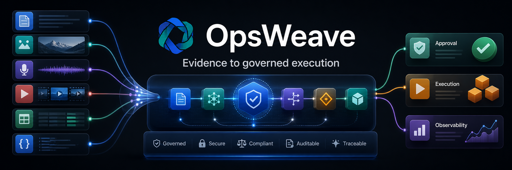
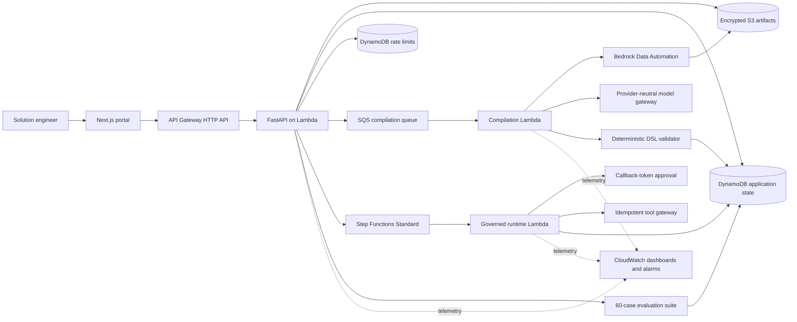
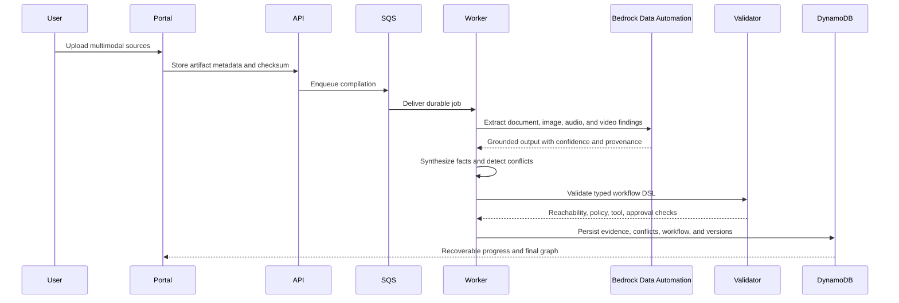
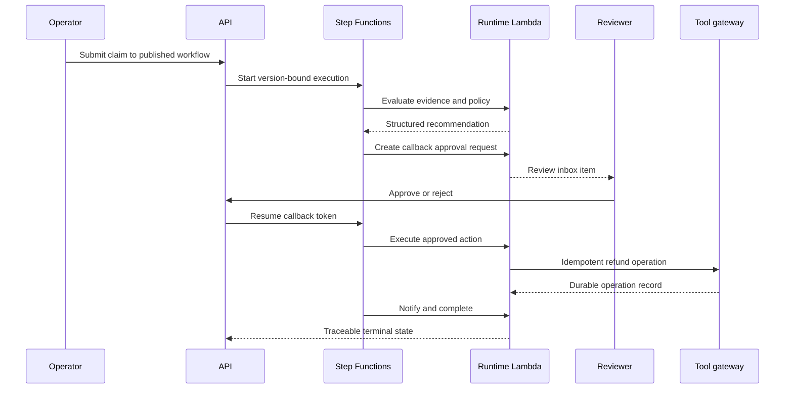

<p align="center">
  
</p>

<p align="center">
  <strong>A multimodal, evidence-bound workflow intelligence platform on AWS.</strong>
</p>

<p align="center">
  <a href="https://opsweave.sauravmukherjee.in/"><strong>Explore the live OpsWeave portal →</strong></a>
</p>

<p align="center">
  <a href="#architecture">Architecture</a> ·
  <a href="#product-surfaces">Product</a> ·
  <a href="#run-locally">Local setup</a> ·
  <a href="#deploy-to-aws">Deployment</a> ·
  <a href="#quality-and-safety">Quality</a>
</p>

<p align="center">
  
  
  
  
  
  
</p>

## What is OpsWeave?

Enterprise processes rarely live in one clean system. The actual workflow is scattered across SOPs, policy PDFs, package photos, employee interviews, spreadsheets, API specifications, and unwritten exceptions.

OpsWeave ingests that fragmented, multimodal evidence and turns it into a versioned workflow that can be inspected, validated, evaluated, approved, and executed. Its first vertical is damaged-shipment claims processing.

This is not a thin chat wrapper. The repository contains a full-stack product, asynchronous multimodal extraction, provenance-aware evidence storage, deterministic workflow validation, a portable JSON DSL, governed AWS execution, human callback approvals, idempotent tools, evaluation gates, traces, audit records, observability, rate limiting, and infrastructure as code.

## Live portal

The public guided workspace is available at **[opsweave.sauravmukherjee.in](https://opsweave.sauravmukherjee.in/)**. Visitors can explore the synthetic logistics evidence, workflow graph, evaluations, execution traces, and audit activity without supplying data. Cognito sign-in creates an isolated workspace for project creation, source uploads, and private configuration.

## Product principles

- **Evidence before inference.** Every generated process fact points back to a source artifact, page, timestamp, or normalized finding.
- **Agents propose; deterministic systems govern.** Model output is schema-validated. Graph reachability, permissions, approval requirements, retries, and terminal paths are checked in code.
- **Compilation and execution are separate trust zones.** Compiler agents cannot invoke consequential runtime tools.
- **Published versions are immutable.** Workflow DSL, prompt configuration, and model aliases are frozen with the deployment.
- **Human judgment remains explicit.** High-risk or malformed output enters a review queue through Step Functions callback tokens.
- **No fake product state.** The portal displays live API, DynamoDB, S3, Bedrock, Lambda, and Step Functions state; unavailable services surface recoverable failures.

## Product surfaces

| Surface | Purpose |
| --- | --- |
| Workspace overview | Project health, sources, compilation readiness, deployed workflow status |
| Projects | Tenant-scoped automation workspaces |
| Source library | PDF, image, audio, video, CSV, JSON, YAML, text, and OpenAPI ingestion |
| Evidence explorer | Normalized findings with confidence and immutable provenance |
| Conflict room | Contradictory policy comparison, recommendation, and explicit resolution |
| Workflow Studio | Typed spatial graph, node inspector, evidence rail, validation issues |
| Review inbox | Live claims requiring human approval |
| Execution trace | Step Functions history, node state, inputs, outputs, decisions, and tool records |
| Evaluation dashboard | Quality, safety, escalation, citation, and regression gates |
| Activity and settings | Audit history, members, model alias, isolation, rate limits, and runtime configuration |

The portal is desktop-first, responsive for tablet review, keyboard accessible, reduced-motion aware, and supports dark and light themes. Dark mode is the default.

## Architecture



### Compilation path



### Governed runtime path



## Portable workflow DSL

Compiled workflows are immutable JSON documents independent of any one orchestration engine. AWS deployment is a deterministic translation step.

```json
{
  "workflow_id": "damaged_claims_workflow",
  "version": 1,
  "trigger": { "type": "api", "input_schema": "claim.v1.json" },
  "nodes": [
    { "id": "extract", "type": "extract" },
    { "id": "policy", "type": "rule" },
    { "id": "recommend", "type": "agent" },
    { "id": "approve", "type": "approval" },
    { "id": "refund", "type": "tool" },
    { "id": "notify", "type": "notification" },
    { "id": "done", "type": "terminal" }
  ]
}
```

Supported node types in V1: `extract`, `retrieve`, `rule`, `agent`, `transform`, `tool`, `approval`, `wait_for_event`, `notification`, and `terminal`.

Agent output must match JSON Schema. Invalid output receives one bounded repair attempt and then enters human review. The validator rejects unreachable nodes, missing terminal paths, undeclared tools, unsafe permissions, and consequential actions without required approvals.

## Repository layout

```text
.
├── apps/
│   ├── web/                 # Next.js App Router product portal
│   ├── api/                 # FastAPI, persistence, runtime API, Lambda image
│   └── workers/             # Extraction, compilation, polling, runtime handlers
├── packages/
│   └── workflow-dsl/        # Shared TypeScript DSL and validators
├── infra/
│   └── terraform/           # Dedicated AWS infrastructure and budget controls
├── output/
│   ├── pdf/                 # Synthetic policy documents
│   └── sample-data/         # Portfolio-safe multimodal demonstration corpus
├── scripts/                 # BDA bootstrap and synthetic corpus generation
├── docs/assets/             # Repository visual assets
└── .github/workflows/       # CI quality and infrastructure checks
```

## Technology stack

| Layer | Technology |
| --- | --- |
| Monorepo | pnpm, Turborepo |
| Web | Next.js App Router, TypeScript, React, Tailwind, Lucide icons, Motion, React Flow |
| API | Python 3.12, FastAPI, Pydantic, async SQLAlchemy, Mangum |
| Multimodal intelligence | Amazon Bedrock Data Automation, Bedrock Converse-compatible gateway |
| Durable runtime | AWS Step Functions Standard, callback task tokens |
| Persistence | DynamoDB on-demand for the cost-bounded demo; PostgreSQL/Aurora module available behind a flag |
| Storage and messaging | S3, SQS, dead-letter queue, EventBridge |
| Identity foundation | Amazon Cognito user pool and OAuth client |
| Hosting | API Gateway HTTP API and Lambda container image |
| Infrastructure | Terraform, ECR, KMS, IAM, AWS Budgets |
| Operations | CloudWatch logs, dashboards, alarms, execution history |

## Demonstration corpus

The repository includes newly created, synthetic logistics material only:

- warehouse damaged-claims SOP PDF;
- finance refund-control policy PDF with an intentional threshold contradiction;
- damaged-package image;
- warehouse interview audio and transcript;
- package inspection video;
- historical claims CSV;
- sample claim JSON;
- logistics sandbox OpenAPI YAML;
- public-source manifest referencing official logistics standards and carrier guidance.

No client data, client code, confidential terminology, or NDA-covered implementation is included.

## Evaluation methodology

The evaluation service executes a deterministic 60-case matrix across four equally sized groups:

- standard;
- ambiguous;
- incomplete;
- adversarial.

Deployment gates measure workflow execution success, citation accuracy, escalation recall, unsafe-action rate, and unnecessary escalation. The seeded live evaluation currently satisfies all four release gates, while unnecessary escalation remains visible as an optimization metric rather than being hidden.

A research extension compares:

1. document-only workflow induction;
2. multimodal workflow induction;
3. multimodal induction with evidence reconciliation.

Useful metrics include process-rule extraction F1, conflict recall, graph-edit distance, execution success, citation accuracy, confidence calibration, and unsafe-action rate.

## Run locally

### Prerequisites

- Node.js 22.13+ (Node.js 24 recommended)
- pnpm 11+
- Python 3.12
- Docker Desktop for container and integration checks
- AWS CLI and Terraform for cloud features

### Install and start

```bash
pnpm install
python3.12 -m venv .venv
.venv/bin/python -m pip install -e 'apps/api[dev]'
cp .env.example .env
pnpm dev
```

Open `http://localhost:3000`. The API runs at `http://localhost:8000`; OpenAPI documentation is available at `/docs`.

Local mode uses SQLite and explicit development identity headers. The AWS demo hydrates tenant-safe source metadata from DynamoDB on cold start.

## Quality and safety

Run the same checks used in CI:

```bash
pnpm --filter web lint
pnpm --filter web typecheck
pnpm --filter web build
.venv/bin/pytest apps/api/tests -q
terraform -chdir=infra/terraform fmt -check -recursive
terraform -chdir=infra/terraform validate
```

Current API suite: **22 passing tests**.

The security boundary includes:

- tenant ID on every application record;
- application authorization plus persistence-layer ownership checks;
- encrypted S3 artifacts and checksums;
- dedicated least-privilege IAM roles;
- file size, MIME, and processing-state controls;
- deterministic tool allowlists and input schemas;
- callback-token approvals for consequential actions;
- idempotency records for tool execution;
- API Gateway throttling plus signed-cookie tenant/global rate limits;
- dead-letter handling, alarms, execution traces, and audit events;
- model-call kill switch in SSM;
- immutable workflow and prompt/model version references.

### Authentication status

The production portal runs a public, read-only guided tenant alongside Cognito-backed private workspaces. OAuth uses authorization-code flow with PKCE and secure, HTTP-only session cookies. The API derives private tenant and actor identity from Cognito access tokens; local development alone accepts explicit development identity headers. Anonymous visitors are rate limited and cannot create projects, upload sources, or change workspace settings.

## Deploy to AWS

All application resources are tagged `Application=OpsWeave` and are isolated from unrelated projects. Copy the example variables and replace placeholders:

```bash
cp infra/terraform/terraform.tfvars.example infra/terraform/terraform.tfvars
export TF_VAR_budget_notification_email='owner@example.com'
terraform -chdir=infra/terraform init
terraform -chdir=infra/terraform plan
terraform -chdir=infra/terraform apply
```

The account ID is required and enforced by the AWS provider's `allowed_account_ids` guard. The Bedrock Data Automation project ARN is also supplied as a variable; neither value is committed.

### Custom domain

The deployed portal is served from **[https://opsweave.sauravmukherjee.in](https://opsweave.sauravmukherjee.in/)**. Terraform provisions the regional ACM certificate, API Gateway custom-domain mapping, Cognito callback URLs, and CORS policy. DNS remains with Netlify, so the apex portfolio and unrelated project subdomains are unaffected.

For another account or domain, set `portal_domain_name`, apply the certificate resource, create the emitted ACM validation CNAME at the authoritative DNS provider, then apply the remaining plan. Finally point the subdomain CNAME at Terraform's `portal_dns_target` output.

Build and push the Lambda-compatible image with an immutable tag:

```bash
pnpm --filter web build
docker build \
  --platform linux/amd64 \
  --provenance=false \
  --sbom=false \
  -f apps/api/Dockerfile.lambda \
  -t "$ECR_REPOSITORY:hosted-v1" .
docker push "$ECR_REPOSITORY:hosted-v1"
```

Then set `api_image_tag` to that immutable tag and apply Terraform. The Lambda container serves both the static portal and API from one HTTPS API Gateway origin, avoiding an always-on web server.

### Cost boundary

The demo architecture is deliberately scale-to-zero or pay-per-request:

- Lambda container API and workers;
- DynamoDB on-demand tables;
- SQS with bounded worker concurrency;
- S3 lifecycle controls;
- short development log retention;
- API throttling and application rate limits;
- disabled relational database by default;
- SSM model-call kill switch;
- tagged monthly AWS Budget alerts.

An AWS Budget is an alerting boundary, not a hard service cutoff. Review Cost Explorer and CloudWatch regularly for a public demo.

## Release gates

- ≥ 90% workflow execution success
- ≥ 95% citation and provenance accuracy
- ≥ 95% recall for human-escalation cases
- zero unauthorized consequential actions
- zero cross-tenant data-access failures
- non-AI API p95 below 500 ms at target load
- WCAG AA and accessibility score ≥ 95
- no critical or high dependency/infrastructure findings
- monthly spend monitored against the configured project budget

## Roadmap

- Cognito JWT authorizer and invite-controlled tenant onboarding
- WebSocket progress channel with HTTP recovery as source of truth
- arbitrary customer OpenAPI connector compilation
- PostgreSQL row-level security and pgvector for larger tenant workloads
- connector credential vaulting and rotation
- screen-video process mining
- multi-region disaster recovery exercises

## Privacy and NDA boundary

OpsWeave is a clean-room portfolio project. Only synthetic data, newly created assets, and publicly cited source material belong in this repository. Do not add client documents, code, prompts, data, terminology, architecture diagrams, or confidential implementation patterns.

---

<p align="center">
  Built to demonstrate full-stack agentic engineering: multimodal intelligence, deterministic governance, AWS deployment, evaluation, maintenance, and production operations.
</p>
